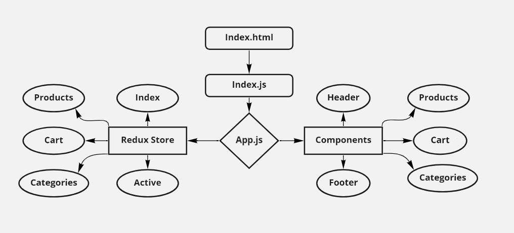

# StoreFront :

## Author : Sukina AbuHammad

## StoreFront : is  an e-Commerce storefront using React with Redux, coupled with your live API server.

### Technical Requirements :
  1. Material UI
  2. Redux Store
  3. Display a list of categories from state
  4. When the user selects (clicks on) a category :
     Identify that category as selected (change of class/display)
     Show a list of products associated with the category

### PULL REQUESTs:
#### Lab36 :
[PullRequestLab36](https://github.com/Sukina12/storefront/pull/1)

### Test :
[Test Action](https://github.com/Sukina12/storefront/actions)

### Deployment:
[My URL]()

### UMl :

